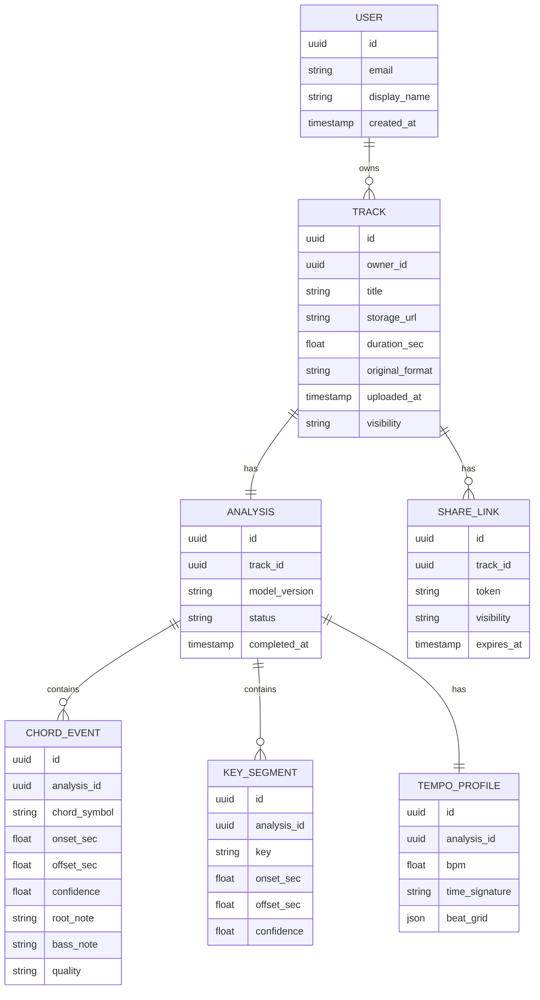

# Projeto — Especificação Técnica & Funcional
### Plataforma de Análise Musical Baseada na Web, Orientada à Precisão

**Versão:** 1.0 (Rascunho para Revisão)
**Responsável pelo Documento:** Produto & Engenharia
**Status:** Especificação / Pré-Implementação

---

## 1. Sumário Executivo

O Projeto é uma aplicação baseada em navegador que permite ao usuário enviar uma peça de música gravada e receber uma análise harmônica e rítmica precisa e visualmente integrada dela: progressões de acordes (incluindo inversões e voicings estendidos quando viável), andamento, tonalidade e características estruturais/melódicas — tudo sobreposto diretamente em uma forma de onda interativa. O produto combina um front end altamente polido e de baixa latência com um pipeline de análise híbrido que executa detecção leve no navegador (via WebAssembly) e delega o reconhecimento computacionalmente pesado e de alta precisão a microsserviços especializados em Python/ML.

O sistema foi projetado em torno de quatro pilares:

1. **Entrada instantânea e tolerante** — upload por arrastar-e-soltar de formatos de áudio comuns, com validação clara e feedback de progresso.
2. **Uma forma de onda interativa de primeira linha** — o centro emocional e funcional do aplicativo, com suporte a zoom, scrub, loop e reprodução em velocidade variável.
3. **Análise musical de alta precisão** — acordes, tonalidade, andamento e além, computados via pipeline híbrido de DSP + deep learning e renderizados como sobreposições sincronizadas.
4. **Saída durável e compartilhável** — cifras exportáveis e imagens de forma de onda anotadas, além de sessões de análise persistentes e compartilháveis para usuários registrados.

---

## 2. Objetivos & Não-Objetivos

### 2.1 Objetivos
- Entregar precisão de reconhecimento de acordes competitiva com sistemas de pesquisa de MIR (Music Information Retrieval) de ponta (meta ≥ 80–85% de weighted chord symbol recall (WCSR) em tríades maiores/menores usando avaliação no estilo benchmark padrão, com degradação graciosa em voicings complexos de jazz).
- Proporcionar uma experiência de forma de onda que se sinta mais próxima de uma DAW profissional (ex.: Ableton, Logic) do que de um player de áudio típico.
- Manter a latência percebida baixa: reprodução e scrub nunca devem esperar pela análise; a análise flui de forma assíncrona e progressiva.
- Suportar uso tanto anônimo (apenas em sessão) quanto registrado (persistente, compartilhável).

### 2.2 Não-Objetivos (v1)
- Separação e remixagem completas de stems multi-faixa (pode ser consideração para v2).
- Análise em tempo real de entrada de microfone ao vivo (v1 é apenas baseado em upload de arquivo).
- Geração musical simbólica, transcrição para notação (gravação completa de partitura) — as exportações da v1 são cifras e imagens anotadas, não partituras gravadas.
- Aplicativos nativos para mobile (v1 é apenas web responsiva).

---

## 3. Personas & Jornadas Centrais do Usuário

| Persona | Necessidade |
|---|---|
| **Músico de show / aprendiz** | Enviar uma música e obter rapidamente os acordes para praticar ou transcrever de ouvido mais rápido. |
| **Professor de música** | Preparar exemplos anotados para alunos; exportar cifras. |
| **Produtor/engenheiro** | Verificar a tonalidade/andamento de uma faixa de referência antes de samplear ou arranjar. |
| **Estudante/pesquisador de teoria musical** | Inspecionar detalhes harmônicos (inversões, voicings, modulações) em nível granular e ampliado. |

**Jornada principal:** Chegar ao app → arrastar um arquivo de áudio → ver o progresso do upload → a forma de onda é renderizada → a análise começa automaticamente e se popula progressivamente (andamento/tonalidade primeiro, acordes fluem em seguida) → o usuário faz scrub/loop em um trecho complicado → o usuário (opcionalmente) faz login → o usuário exporta um PDF de cifra ou compartilha um link.

---

## 4. Requisitos Funcionais

### 4.1 Interface do Usuário / UX

**Linguagem de design:** Estética "studio" moderna, minimalista e de alto contraste sob demanda — modo escuro por padrão (comum em ferramentas de áudio, reduz o cansaço visual em sessões longas) com alternância para modo claro. Espaçamento generoso, uma única cor de destaque forte reservada para o estado de reprodução/análise (ex.: o playhead, destaque do acorde ativo) e uso contido de gradientes/sombras para manter o foco na forma de onda.

**Layout (desktop, ≥1280px):**
- Barra superior persistente: logo, título do projeto/faixa (editável), menu de conta, ações de compartilhar/exportar.
- Palco central: forma de onda + controles de transporte, largura total, verticalmente dominante.
- Painel retrátil à direita: resumo da análise (Tonalidade, BPM, fórmula de compasso, estrutura detectada) e lista/timeline de acordes rolável em sincronia com a reprodução.
- Barra de transporte mínima ancorada na parte inferior ao rolar, para que os controles estejam sempre acessíveis.

**Comportamento responsivo:**
- **Tablet (768–1279px):** o painel direito colapsa em uma gaveta deslizável abaixo da forma de onda.
- **Mobile (<768px):** pilha de coluna única — upload/forma de onda primeiro, controles de transporte fixados na parte inferior como barra fixa (respeitando safe-area insets), o painel de análise se torna uma folha expansível. A forma de onda ganha pinch-to-zoom e scrub por toque e arrasto.

**Interação & movimento:**
- Todas as mudanças de estado (upload → processamento → analisado) usam skeleton loaders e transições curtas (150–250ms) com easing, nunca saltos abruptos de conteúdo.
- As sobreposições de acordes surgem com fade/slide na posição conforme são reconhecidas, em vez de aparecerem de repente, para que a análise progressiva pareça viva e não travada.
- Atalhos de teclado para usuários avançados: Space (play/pause), J/K/L (scrub), I/O (definir loop in/out), +/- (zoom).

**Acessibilidade (meta WCAG 2.1 AA):**
- Navegabilidade completa por teclado dos controles de transporte, upload e exportação.
- Regiões ARIA live anunciam o progresso e a conclusão da análise para leitores de tela.
- Cor nunca é o único codificador de informação — segmentos de acordes também são rotulados com texto; contraste da forma de onda verificado tanto em fundos claros quanto escuros.
- Tamanho mínimo de alvo de toque de 44×44px em layouts de toque.

---

### 4.2 Upload & Ingestão de Áudio

**Formatos suportados (v1):** MP3, WAV, FLAC, OGG/Vorbis. (AAC/M4A como meta secundária, se a decodificação permitir via WebCodecs/ffmpeg.wasm.)

**Mecanismos de upload:**
- Zona de arrastar-e-soltar cobrindo a área hero principal de estado vazio, com estado de hover (destaque de borda + animação de ícone).
- Botão alternativo "Browse files" (input de arquivo nativo) para acessibilidade e ambientes sem arrastar.
- Importação por URL (opcional v1.1): colar uma URL direta de áudio para busca no lado do servidor, sujeita a restrições de tamanho/CORS.

**Validação & feedback (lado do cliente, antes do upload começar):**
- Verificação de MIME/tipo e extensão de arquivo (checagem de magic-byte, não apenas confiar na extensão).
- Tamanho máximo de arquivo aplicado (ex.: 100 MB no plano gratuito / 500 MB no plano registrado — configurável) com erro claro e específico ("Este arquivo tem 214 MB; o limite é 100 MB — tente um formato comprimido como MP3.").
- Verificação de sanidade da duração após decodificação (ex.: rejeitar arquivos de 0 duração ou >30 minutos com mensagem específica no plano gratuito).
- Detecção de arquivo corrompido/ilegível via sonda de decodificação antes de commitar o upload completo.

**UX de upload:**
- Barra de progresso determinada com percentual em nível de byte e tempo restante estimado para arquivos grandes.
- Upload em chunks/retomável (protocolo tus ou S3 multipart) para que uma conexão caída não force reinício total.
- Prévia local imediata da forma de onda renderizada no cliente a partir do buffer decodificado enquanto o upload de rede prossegue em paralelo — o usuário nunca fica olhando para uma tela em branco esperando a rede.
- Estados de erro claros e acionáveis: formato não suportado, grande demais, longo demais, falha de rede (com retry), rejeitado pelo servidor (com motivo).

---

### 4.3 Visualização da Forma de Onda & Reprodução

Este é o núcleo interativo do produto.

**Renderização:**
- Renderização de forma de onda baseada em picos multi-resolução (pirâmide de picos min/max computada no cliente) para que o zoom de "música inteira" a "batida única" permaneça fluido (meta de 60fps) sem re-decodificar o áudio.
- Renderização baseada em Canvas/WebGL (não SVG/DOM) para desempenho em altos níveis de zoom e longas durações.
- Renderização em duas camadas: uma régua/minimapa "overview" estática abaixo da forma de onda principal para navegação global, e a forma de onda detalhada ampliada acima dela — clicar/arrastar o minimapa reposiciona a visualização principal (espelha convenções de DAW).

**Controles de transporte:**
- Play / Pause / Stop, com um playhead preciso sincronizado a `AudioContext.currentTime`, não a eventos timeupdate do elemento `<audio>` (que são grosseiros demais para trabalho com precisão de batida).
- Scrubbing: clique-e-arraste na forma de onda busca com prévia audível de "scratch" (reprodução curta em janela na posição do arrasto), padrão em ferramentas de áudio profissionais.
- Zoom: zoom contínuo via scroll-wheel/pinch, além de fit-to-window e presets de zoom fixos (1 compasso, 4 compassos, faixa inteira).
- **Regiões de loop:** clique-e-arraste para definir uma região de loop in/out diretamente na forma de onda; a região é arrastável/redimensionável após a criação; o loop pode se encaixar na grade de batidas/compassos detectada (ver §4.5) para looping musicalmente útil.
- **Velocidade de reprodução variável:** 0.25x–2.0x via algoritmo de time-stretch que preserva o pitch (ex.: phase vocoder / WSOLA implementado via Web Audio `AudioWorklet` ou biblioteca DSP em WASM) para que trechos desacelerados permaneçam na tonalidade correta para treino de ouvido.
- Volume, mudo e um filtro simples de EQ/low-pass "focus" (opcional, ajuda a isolar linhas de baixo para confirmação da fundamental do acorde).

**Arquitetura de sincronização:**
- Um único "transport clock" compartilhado (acionado por `AudioContext`) é a fonte da verdade; o playhead da forma de onda, o destacador de acordes e quaisquer listeners externos (ex.: uma sobreposição de metrônomo) todos se inscrevem nesse clock via `requestAnimationFrame`, garantindo que elementos de sobreposição nunca se desviem visivelmente do áudio, mesmo durante scrub ou mudanças de velocidade.

---

### 4.4 Motor de Reconhecimento de Acordes ("Altíssima Precisão")

**Objetivo:** identificar símbolos de acordes (ex.: `Cmaj7`, `Gsus4`, `F#m`, `Bb7/D`) com timing preciso de onset/offset, e renderizá-los como segmentos alinhados no tempo sobrepostos na forma de onda.

**Pipeline (ver §6.4 para detalhe arquitetural completo):**
1. **Extração de features:** Constant-Q Transform (CQT) ou chroma CQT (perfil de energia de classe de altura de 12 bins) computado em hop size fino (~10ms) para precisão temporal, mais uma pré-passagem de harmonic-percussive source separation (HPSS) para suprimir transientes de bateria que corrompem estimativas de chroma.
2. **Estimação de acordes em nível de frame:** um modelo profundo treinado (CNN/CRNN ou encoder baseado em Transformer, seguindo a família de arquiteturas usada por sistemas como CREMA/Chordino/detectores de acordes do Essentia) produz uma distribuição de probabilidade sobre um vocabulário de acordes por frame.
3. **Suavização temporal / decodificação:** uma camada de Hidden Markov Model (HMM) ou Conditional Random Field (CRF) com priors de transição musicalmente informados (acordes não mudam a cada 10ms; certas progressões são mais prováveis que outras) decodifica as probabilidades em nível de frame em eventos de acorde estáveis em nível de segmento com timestamps de onset/offset.
4. **Camadas de vocabulário:**
   - **Camada 1 (rápida, sempre ativa):** tríades maiores/menores, sétimas dominantes — roda no cliente via WASM para feedback instantâneo de baixa latência.
   - **Camada 2 (alta precisão, assistida pelo servidor):** acordes estendidos/alterados — 7ªs, 9ªs, sus2/sus4, add9, diminutos/aumentados, slash chords (inversões) — computados no servidor pelo microsserviço de ML e transmitidos de volta para refinar a estimativa inicial do cliente.
5. **Consciência de inversão/voicing:** a detecção de nota de baixo (energia forte mais grave no CQT, verificada cruzadamente com um rastreador de pitch dedicado ao baixo) é usada para rotular inversões (ex.: `C/E`) e desambiguar voicings onde o conteúdo harmônico é ambíguo (ex.: distinguir um voicing sem fundamental de um acorde diferente).
6. **Pontuação de confiança:** cada segmento de acorde carrega uma pontuação de confiança; a UI distingue visualmente segmentos de alta confiança vs. incertos (ex.: preenchimento sólido vs. hachurado), e trechos de baixa confiança podem oferecer ao usuário 2–3 interpretações alternativas ao passar o mouse/tocar.

**Requisitos de sobreposição visual:**
- Acordes renderizam como blocos coloridos rotulados diretamente abaixo/dentro da faixa da forma de onda, largura proporcional à duração e pixel-precisa ao onset/offset no nível de zoom atual.
- A sobreposição atualiza progressivamente conforme a análise flui (resultados da Camada 1 aparecem em segundos; a Camada 2 os refina no lugar sem mudanças bruscas de layout — substituição com cross-fade, não pop-in).
- Passar o mouse/tocar em um bloco de acorde mostra o nome da nota, confiança e (se disponível) um pequeno diagrama de voicing.
- Uma "chord strip" dedicada abaixo da forma de onda permanece visível em todos os níveis de zoom como uma timeline condensada, para que o usuário retenha contexto harmônico global mesmo ampliado em uma única batida.

---

### 4.5 Análise Musical Estendida

Todos os itens abaixo são computados na mesma passagem do pipeline que o reconhecimento de acordes (extração de features compartilhada quando possível) e renderizados como camadas de sobreposição sincronizadas adicionais, alternáveis independentemente.

- **Detecção de andamento / BPM:** envelope de onset-strength + autocorrelação ou um modelo profundo de estimação de andamento (ex.: seguindo abordagens como o rastreador de batidas DBN do madmom); produz um BPM global mais uma **sobreposição de grade de batidas/compassos** na forma de onda (marcas finas nas quais usuários podem encaixar loops/zoom), e sinaliza mudanças de andamento/trechos de rubato em vez de forçar um único BPM médio enganoso.
- **Identificação de tonalidade:** correlação de perfil de tonalidade de Krumhansl-Schmuckler e/ou um modelo treinado de classificação de tonalidade sobre o chroma agregado; produz tanto a tonalidade detectada (ex.: "D menor") quanto uma pontuação de confiança, e sinaliza modulações prováveis (mudanças de tonalidade) como segmentos separados na timeline em vez de um único rótulo global quando a peça muda de tonalidade.
- **Detecção de fórmula de compasso:** inferida da periodicidade da grade de batidas (ex.: 4/4 vs 3/4 vs 6/8), mostrada ao lado do BPM.
- **Segmentação estrutural (stretch/roadmap):** segmentação baseada em matriz de auto-similaridade para propor fronteiras de seção (intro/verso/refrão/ponte), renderizadas como faixas rotuladas acima da forma de onda — genuinamente útil para navegação em faixas longas.
- **Contorno melódico (stretch):** para trechos monofônicos ou de melodia dominante, uma sobreposição de rastreamento de pitch (ex.: estimação de pitch neural no estilo pYIN ou CREPE) renderizada como uma linha de contorno fina, útil para análise vocal/instrumento principal.
- **Complexidade rítmica (stretch):** uma métrica derivada (ex.: índice de síncope a partir da densidade de onsets vs. a grade de batidas) exibida como um indicador/pontuação simples em vez de uma sobreposição densa, para evitar poluição visual.

Todas as sobreposições compartilham a mesma timeline horizontal que a forma de onda e a chord strip, e podem ser mostradas/ocultadas independentemente via um painel de alternância de camadas, já que mostrar tudo de uma vez sobrecarregaria a visualização.

---

### 4.6 Exportação & Compartilhamento

**Formatos de exportação:**
- **Cifra (PDF/HTML):** cifra limpa, pronta para impressão, de símbolos de acordes alinhados a compassos/tempo, com título da música, tonalidade e cabeçalho de BPM — utilizável diretamente por um músico.
- **Imagem de forma de onda anotada (PNG/SVG):** um snapshot renderizado da forma de onda com sobreposição de acordes, cabeçalho de tonalidade/BPM e (opcionalmente) uma região de loop selecionada destacada — para compartilhar em redes sociais, em notas de aula, etc.
- **Exportação de dados estruturados (JSON/CSV):** exportação legível por máquina de todos os eventos detectados (acordes com timestamps, tonalidade, BPM, grade de batidas) para usuários que querem levar resultados para outra ferramenta.
- **Faixa de acordes MusicXML / MIDI (stretch):** para interoperabilidade com softwares de notação.

**Compartilhamento:**
- Usuários registrados podem gerar um link compartilhável e somente leitura para uma faixa analisada específica (e opcionalmente um deep link para uma região de loop/timestamp específico, ex.: "confira a ponte em 1:42").
- Visualizações compartilhadas são totalmente interativas (reprodução, zoom), mas ações de exportação/re-upload são restritas ao fato de o visualizador ter sua própria conta, para prevenir abuso.
- Controles de privacidade: privado (apenas proprietário), não listado (somente por link) ou público (descobrível no perfil público do usuário, se esse recurso estiver habilitado).

---

### 4.7 Contas de Usuário & Persistência de Dados

- **Uso anônimo:** a funcionalidade completa de análise funciona sem conta; resultados persistem apenas em sessão (memória do navegador + URL assinada de curta duração), claramente comunicado ("Faça login para salvar esta análise") para que usuários não sejam surpreendidos por perda de dados.
- **Contas registradas:** login por email/senha + OAuth (Google, Apple); biblioteca persistida de uploads/análises anteriores, renomeável, organizável em pastas/playlists.
- **Retenção de dados:** uploads anônimos/convidados são automaticamente purgados do armazenamento após uma janela limitada (ex.: 24–72 horas), a menos que reclamados ao fazer login durante essa janela; dados de usuários registrados persistem até serem excluídos pelo usuário, conforme a política de retenção comunicada na política de privacidade.

---

## 5. Requisitos Não-Funcionais

| Categoria | Requisito |
|---|---|
| **Desempenho** | Interações com a forma de onda (scrub/zoom) mantêm ≥60fps; renderização inicial da forma de onda <1s após decodificação para faixas de até ~10 minutos; a passagem rápida (Camada 1) de acordes completa em poucos segundos após o upload; o refinamento da Camada 2 completa em dezenas de segundos, dependendo do comprimento da faixa e da carga do servidor. |
| **Escalabilidade** | Microsserviços de análise horizontalmente escaláveis e stateless; baseados em fila (não requisição/resposta síncrona) para jobs da Camada 2, para que picos de tráfego degradem graciosamente (maior espera na fila) em vez de falhar completamente. |
| **Confiabilidade** | Degradação graciosa: se o microsserviço de ML estiver indisponível, o app ainda entrega resultados da Camada 1 no cliente e rotula claramente recursos da Camada 2 como "temporariamente indisponíveis" em vez de falhar a sessão inteira. |
| **Segurança** | URLs assinadas e expiráveis para acesso ao armazenamento de áudio; revalidação no servidor do tipo/tamanho de arquivo independentemente das checagens do cliente; verificações padrão de autorização em todos os endpoints de link compartilhado e exportação. |
| **Privacidade** | Áudio enviado é conteúdo do usuário — sem compartilhamento/uso para treinamento por terceiros sem opt-in explícito; controles claros de retenção/exclusão; TLS em tudo; criptografado em repouso. |
| **Acessibilidade** | WCAG 2.1 AA, conforme detalhado em §4.1. |
| **Suporte a navegadores** | Duas últimas versões de Chrome, Firefox, Safari, Edge; fallback gracioso com feature-detection onde o suporte a Web Audio/WASM/WebGL é parcial (ex.: Safari mobile mais antigo). |
| **Internacionalização** | Texto da UI externalizado para tradução desde a v1, mesmo que apenas o inglês seja lançado inicialmente. |

---

## 6. Arquitetura do Sistema

### 6.1 Visão Geral de Alto Nível

```mermaid
flowchart LR
    subgraph Client["Browser (SPA)"]
        UI[UI / React App]
        WA[Web Audio Engine]
        WASM[WASM DSP Module\n(fast chroma, onset, Tier-1 chords)]
        UI <--> WA
        WA <--> WASM
    end

    subgraph Edge["Edge / CDN"]
        CDN[Static Assets + Cached Waveform Peaks]
    end

    subgraph API["API Gateway / BFF"]
        GW[REST + WebSocket Gateway]
        AUTH[Auth Service]
    end

    subgraph Storage["Storage Layer"]
        OBJ[(Object Storage\nRaw Audio + Peaks)]
        DB[(Relational DB\nUsers, Tracks, Analyses)]
        CACHE[(Redis Cache)]
    end

    subgraph Analysis["Analysis Microservices (Python)"]
        QUEUE[[Job Queue\nKafka / SQS / Redis Streams]]
        FEAT[Feature Extraction Service\nlibrosa / essentia]
        CHORD[Chord Recognition Service\nDeep model + HMM decoder]
        KEYBPM[Key/Tempo Service]
        STRUCT[Structure/Melody Service]
    end

    Client <-- HTTPS/WSS --> GW
    Client <-- fetch --> CDN
    GW <--> AUTH
    GW <--> DB
    GW <--> CACHE
    GW --> OBJ
    GW --> QUEUE
    QUEUE --> FEAT --> CHORD
    FEAT --> KEYBPM
    FEAT --> STRUCT
    CHORD --> DB
    KEYBPM --> DB
    STRUCT --> DB
    GW -. WebSocket progress .-> Client
```

**Racional de design:** a divisão entre uma "camada rápida" no cliente com WASM e uma "camada de precisão" no servidor com Python permite que o app pareça instantâneo (acordes começam a aparecer em segundos, inteiramente no cliente, sem round trip) enquanto ainda entrega a precisão mais profunda e pesada em modelos que genuinamente requer computação no servidor — sem bloquear a UI por causa disso.

### 6.2 Arquitetura do Frontend

- **Framework:** React (ou framework de componentes comparável) com uma camada de estado dedicada para reprodução/transporte (ex.: uma pequena store customizada ou Zustand) mantida separada do estado geral da UI, já que o transport clock precisa atualizar na frequência de animation-frame sem re-renderizar toda a árvore de componentes.
- **Camada de motor de áudio:** encapsula a Web Audio API nativa (`AudioContext`, `AudioBufferSourceNode`, `AudioWorkletNode` para time-stretching) atrás de uma API interna limpa (`play()`, `seek(t)`, `setLoop(a,b)`, `setRate(r)`) para que componentes de UI nunca toquem primitivas cruas de Web Audio diretamente.
- **Camada de renderização:** renderizador de forma de onda em Canvas/WebGL, desacoplado do ciclo de renderização do React — acionado por `requestAnimationFrame` e chamadas de desenho imperativas para desempenho; React apenas monta/desmonta o canvas e passa configuração, não re-renderiza por frame.
- **Módulo WASM:** compilado de um núcleo DSP em C++/Rust (ex.: construído sobre, ou inspirado em, bibliotecas como Essentia.js/aubio) expondo FFT, extração de CQT/chroma, detecção de onset e um classificador leve de acordes da Camada 1 — carregado uma vez, invocado via Web Worker para manter a thread principal livre para interatividade da UI.
- **Camada de dados:** cliente de API tipado (ex.: gerado de um schema OpenAPI/GraphQL) mais uma assinatura WebSocket para streaming de progresso/resultados de análise para a UI sem polling.

### 6.3 Arquitetura do Backend

- **API Gateway / BFF (Backend-for-Frontend):** um serviço leve (Node.js ou similar) lidando com auth, orquestração de requisições e tradução de eventos internos de microsserviços em pushes WebSocket para o cliente. **Não** realiza análise pesada de áudio por conta própria.
- **Serviço de auth:** padrão baseado em OAuth2/OIDC, emitindo JWTs de curta duração; gerenciamento de sessão e refresh-token.
- **Object storage:** áudio bruto enviado e arquivos pré-computados de picos de forma de onda (para que recarregar uma faixa nunca exija re-decodificar o arquivo completo) — ex.: armazenamento compatível com S3 com URLs assinadas.
- **Banco de dados relacional:** usuários, faixas, resultados de análise (acordes, tonalidade/BPM, estrutura) como registros normalizados e consultáveis — permitindo recursos como "encontrar todas as minhas faixas em D menor" mais tarde.
- **Fila de jobs:** desacopla a conclusão do upload da análise; permite retry, back-pressure e escalabilidade horizontal independente de cada microsserviço de análise. Uma mensagem por estágio (feature-extraction-complete → dispara os serviços de chord + key/BPM + structure em paralelo) permite o processamento paralelo descrito.
- **Microsserviços de análise (Python):** o lar natural para este trabalho dada a maturidade do ecossistema Python de áudio/ML (librosa, essentia, madmom, PyTorch/TensorFlow para os modelos treinados de acorde/tonalidade). Cada microsserviço é independentemente implantável e escalável, comunica-se via fila de jobs e escreve resultados no banco de dados, e envia eventos de progresso de volta pelo gateway.
- **Cache:** Redis para dados de hot-path (metadados de faixas vistas recentemente, status de jobs em andamento) para manter a UI responsiva sob carga.

### 6.4 Serviço de Reconhecimento de Acordes — Detalhe

```mermaid
flowchart TD
    A[Uploaded Audio] --> B[Resample / Normalize]
    B --> C[Harmonic-Percussive\nSource Separation]
    C --> D[CQT / Chroma\nFeature Extraction\n~10ms hop]
    D --> E[Deep Chord Model\n(CNN/CRNN or Transformer)\nper-frame chord probabilities]
    D --> F[Bass-line Pitch Tracker\nfor inversion detection]
    E --> G[HMM / CRF Temporal\nSmoothing & Decoding]
    F --> G
    G --> H[Segment-level Chord Events\nwith onset/offset + confidence]
    H --> I[(Analysis DB)]
    H --> J[WebSocket push\nto client]
```

Este serviço é versionado independentemente (`chord-model-v1`, `v2`, ...) para que o modelo de reconhecimento possa ser melhorado/retreinado ao longo do tempo sem mudanças no cliente, desde que o contrato de saída (rótulo de acorde, onset, offset, confiança, alternativas opcionais) permaneça estável.

### 6.5 Modelo de Dados (Entidades Centrais)



### 6.6 Design da API (Endpoints Representativos)

| Método | Endpoint | Propósito |
|---|---|---|
| `POST` | `/api/tracks` | Iniciar upload (retorna URL de armazenamento assinada + registro da faixa). |
| `PUT` | `{signed_url}` | Upload em chunks direto do cliente para o armazenamento. |
| `POST` | `/api/tracks/{id}/analyze` | Disparar o pipeline de análise (idempotente). |
| `GET` | `/api/tracks/{id}/analysis` | Buscar o estado atual da análise + resultados. |
| `WS` | `/ws/tracks/{id}` | Assinar eventos de progresso/resultado em streaming. |
| `GET` | `/api/tracks/{id}/export?format=pdf\|png\|json\|midi` | Gerar/exportar artefato de análise. |
| `POST` | `/api/tracks/{id}/share` | Criar um link de compartilhamento com uma configuração de visibilidade. |
| `GET` | `/api/shared/{token}` | Busca pública somente leitura para links compartilhados. |

Todos os endpoints autenticados requerem um bearer JWT; endpoints de upload e análise são limitados por taxa por usuário/IP para controlar abuso e custo.

---

## 7. Stack de Tecnologia (Proposta)

| Camada | Tecnologia |
|---|---|
| Framework de frontend | React + TypeScript |
| Renderização de forma de onda/gráficos | Canvas2D/WebGL (renderizador customizado, ou uma base como WaveSurfer.js estendida com camadas de sobreposição customizadas) |
| Motor de áudio do cliente | Web Audio API + `AudioWorklet` para reprodução com time-stretch/preservação de pitch |
| DSP no cliente | Módulo WebAssembly (Rust ou C++ compilado via Emscripten), construído sobre primitivas de FFT/CQT similares às do Essentia.js/aubio |
| Gerenciamento de estado | Zustand ou Redux Toolkit (UI geral) + store dedicada de transport-clock |
| API gateway | Node.js (NestJS/Express) ou equivalente |
| Atualizações em tempo real | WebSocket (ou Server-Sent Events como fallback mais simples) |
| Microsserviços de análise | Python (FastAPI) + librosa, essentia, madmom |
| Modelos de ML | Modelos de acorde/tonalidade CNN/CRNN ou Transformer treinados em PyTorch/TensorFlow, servidos via TorchServe/Triton ou um wrapper de inferência FastAPI leve |
| Fila de jobs | Kafka, AWS SQS ou Redis Streams |
| Banco de dados relacional | PostgreSQL |
| Object storage | Compatível com S3 (AWS S3, Cloudflare R2, etc.) |
| Cache | Redis |
| Auth | OAuth2/OIDC (ex.: Auth0/Clerk ou auto-hospedado) |
| Infra/deploy | Contêineres Docker, Kubernetes (ou uma plataforma de contêineres gerenciada) para os microsserviços; CDN para assets estáticos e arquivos de picos de forma de onda em cache |
| Observabilidade | Logging estruturado + tracing (OpenTelemetry), dashboards de métricas, monitoramento de precisão/latência por modelo |

---

## 8. Roadmap (Marcos Indicativos)

1. **M1 — Fundação:** Fluxo de upload, renderização/reprodução da forma de onda (sem análise ainda), shell de UI responsiva.
2. **M2 — Análise da camada rápida:** Detecção de acordes da Camada 1 no cliente via WASM (maiores/menores/7ªs), estimação básica de BPM/tonalidade, sobreposições na forma de onda.
3. **M3 — Análise da camada de precisão:** Microsserviços Python no servidor para vocabulário estendido de acordes, inversões, tonalidade/andamento refinados, resultados em streaming via WebSocket.
4. **M4 — Contas & persistência:** Auth, biblioteca salva, política de retenção para uploads anônimos.
5. **M5 — Exportação & compartilhamento:** Exportação PDF/PNG/JSON, links compartilháveis somente leitura.
6. **M6 — Análise avançada (stretch):** Segmentação estrutural, contorno melódico, indicadores de complexidade rítmica.

---

## 9. Riscos & Mitigações

| Risco | Mitigação |
|---|---|
| Precisão do reconhecimento de acordes fica aquém em material complexo/jazz | Vocabulário em camadas + pontuação de confiança + UI de interpretação alternativa, para que o produto seja transparente sobre incerteza em vez de silenciosamente errado. |
| Custos de ML no servidor escalam mal com o uso | Processamento baseado em fila com limites por camada (ex.: limitar comprimento/frequência de faixas da Camada 2 no plano gratuito); cache de resultados de análise por fingerprint único de áudio para evitar recomputação de arquivos idênticos. |
| Sincronização de sobreposição em tempo real se desvia do áudio durante scrub/mudanças de velocidade | Transport clock único compartilhado acionado por `AudioContext` como única fonte da verdade (§4.3), com todas as sobreposições como assinantes puros. |
| Uploads de arquivos grandes falham em conexões ruins | Protocolo de upload em chunks/retomável (§4.2). |
| Preocupações de copyright/conteúdo com áudio enviado | ToS claro sobre uso permitido (análise pessoal/educacional), sem redistribuição do áudio fonte via recursos de compartilhamento (links compartilhados expõem a *análise*; a reprodução é restrita apropriadamente conforme decisões de política de licenciamento). |

---

## 10. Questões Abertas para Input das Partes Interessadas

1. Qual é o benchmark de precisão alvo e o conjunto de dados de avaliação para aprovação do reconhecimento de acordes?
2. Quais são os limites do plano gratuito vs. plano pago (tamanho de arquivo, comprimento de faixa, cota de análise da Camada 2)?
3. Links compartilhados devem expor a reprodução completa do áudio, ou apenas a camada visual/anotação, dadas considerações de licenciamento?
4. O suporte a aplicativo mobile nativo está no roadmap de curto prazo, ou a web responsiva é suficiente para o lançamento inicial?